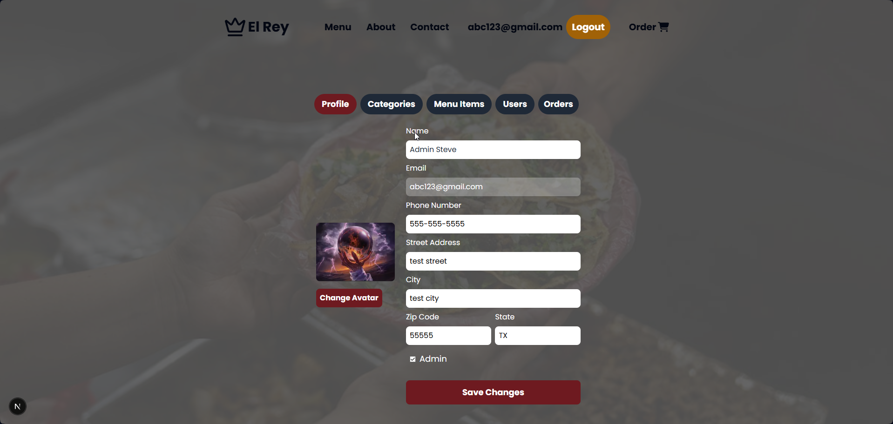
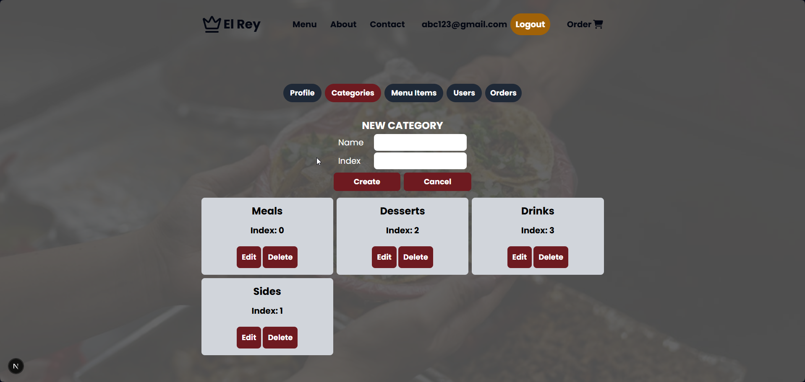
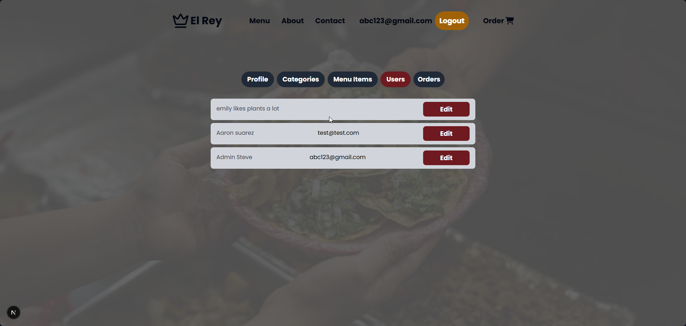
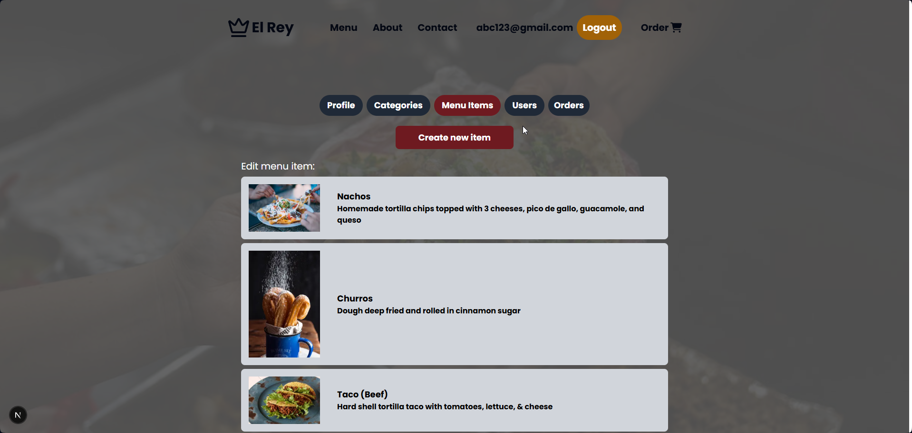
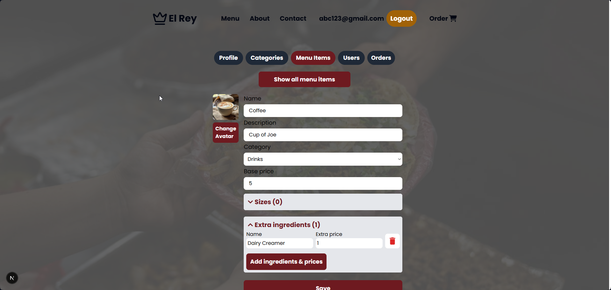
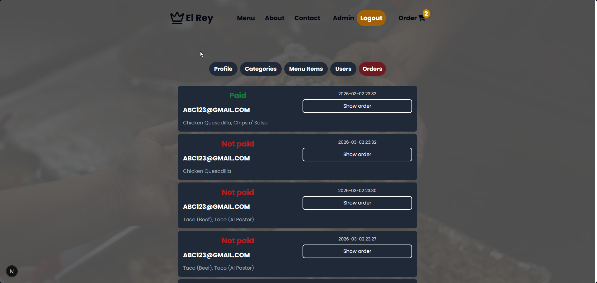

# El Rey restaurant site
- Next.js
- Tailwind CSS
- Express/Node.js
- MongoDB
- Framer Motion
- Stripe checkout
- Google credentials signup
- Context API for cart/orders
- Custom admin panel for owners

## Demo
[El Rey](https://next-js-food-order-el-rey.vercel.app)

